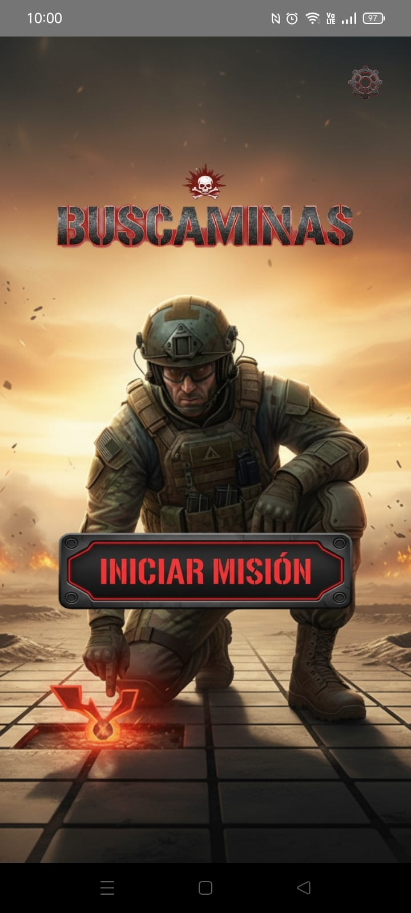
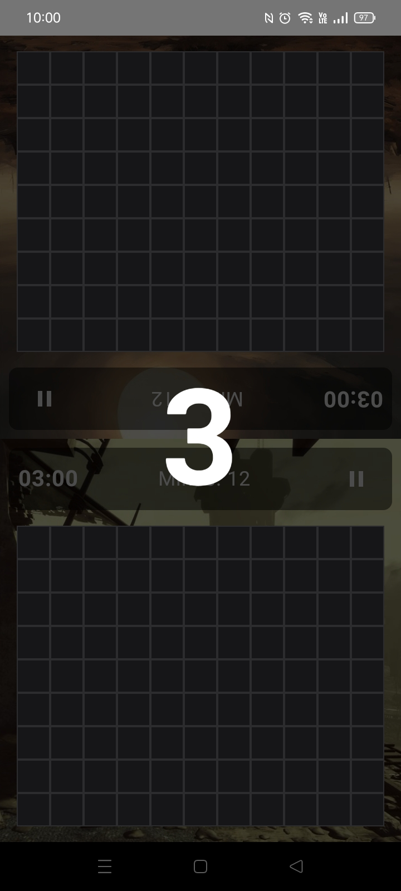
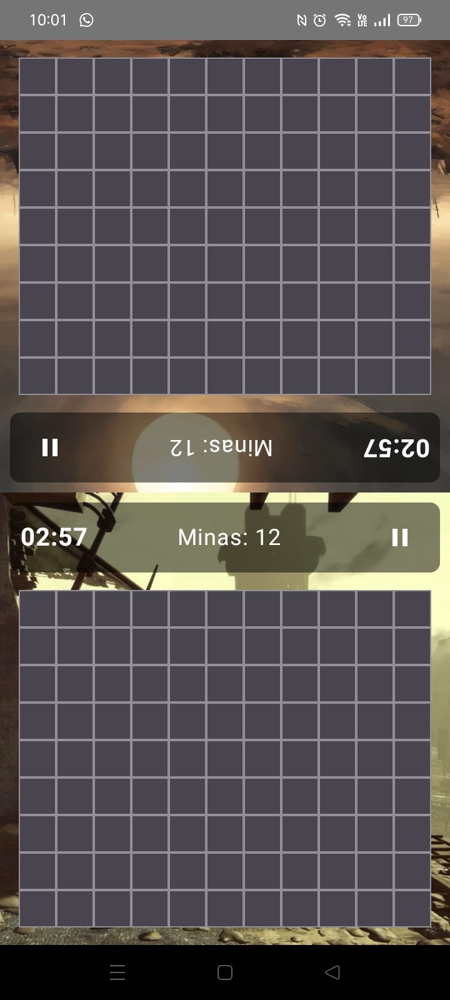
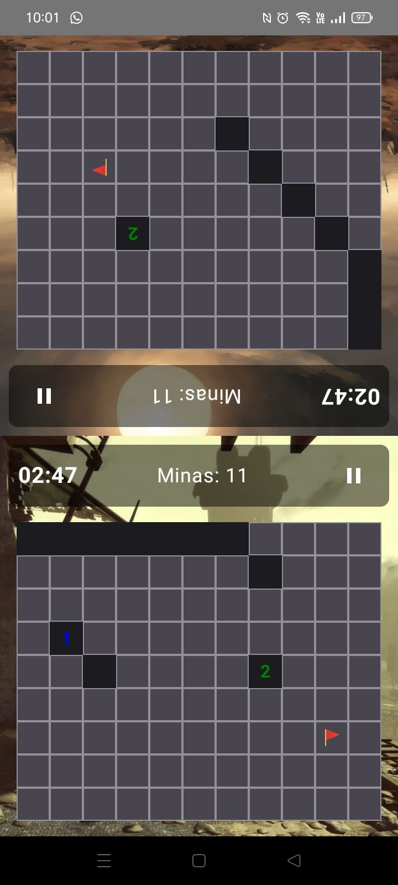
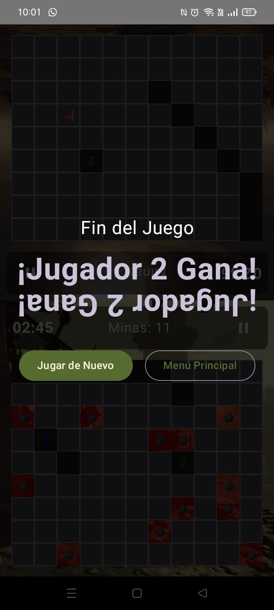
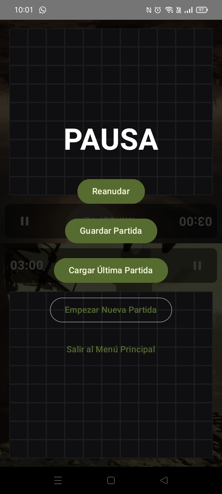

<h1 align="center">Tarea 4: Desarrollo de un juego para 2 jugadores</h1>

---

## Índice
- [Título](#tarea-4-desarrollo-de-un-juego-para-2-jugadores)
- [Insignias](#insignias)
- [Índice](#índice)
- [Objetivo](#objetivo)
- [Descripción del proyecto](#descripción-del-proyecto)
- [Capturas de pantalla](#capturas-de-pantalla)
- [Características principales](#características-principales)
- [Stack tecnológico](#stack-tecnológico)
- [Estructura del proyecto](#estructura-del-proyecto)
- [Estado de la tarea](#estado-de-la-tarea)
- [Características de la aplicación](#características-de-la-aplicación)
- [Acceso al proyecto](#acceso-al-proyecto)
- [Desarrolladores](#-desarrolladores)

---

# Insignias

---

## Objetivo

El propósito de esta actividad es que desarrollen una aplicación Android que implemente un juego interactivo para dos personas, demostrando el uso de componentes de interfaz modernos y lógica de juego bien estructurada.

---

## Descripción del proyecto

Se realizó una reimaginación moderna del clásico Buscaminas, desarrollado de forma nativa para Android. Este proyecto implementa una versión multijugador local en pantalla dividida, construido con tecnologías del ecosistema de Android, incluyendo Kotlin y Jetpack Compose. Existe alternancia clara entre los dos jugadores con indicación visual de quién juega y existe un conteo de victorias, puntos o progreso según la naturaleza del juego.

---

## Capturas de Pantalla

<table>
  <tr>
    <th>Inicio</th>
    <th>Modo oscuro</th>
    <th>Inicio de partida</th>
    <th>Inicialización</th>
  </tr>
  <tr>
    <th>
      
    </th>
    <th>
      
    </th>
    <th>
      
    </th>
    <th>
      
    </th>
  </tr>
</table>

<table>
  <tr>
    <th>Juego en curso</th>
    <th>Fin de la partida</th>
    <th>Opciones</th>
  </tr>
  <tr>
    <th>
      
    </th>
    <th>
      
    </th>
    <th>
      
    </th>
  </tr>
</table>

## Características Principales

-   **🎮 Modo Multijugador Local:** La pantalla se divide en dos, con una mitad rotada 180 grados para una experiencia de juego cómoda cara a cara en un solo dispositivo.
-   **⏱️ Partidas Cronometradas:** Cada jugador compite contra el reloj (3 minutos) para despejar su tablero. ¡El tiempo más rápido gana!
-   **Penalización por Error:** Marcar una bandera incorrectamente añade 5 segundos de penalización al marcador final.
-   **💾 Guardado y Carga de Partidas:** El estado actual del juego (tableros, tiempo restante) se puede pausar y guardar en un archivo JSON. La partida se puede reanudar en cualquier momento, incluso después de cerrar la aplicación.
-   **⚙️ Ajustes de Usuario Persistentes:**
    -   **Modo Oscuro:** Habilita o deshabilita el tema oscuro.
    -   **Idioma:** (Funcionalidad preparada para futura implementación).
    -   Las preferencias se guardan y se recuerdan en inicios posteriores de la app usando Jetpack DataStore.
-   **🎨 Interfaz Moderna y Tematizada:** La UI está construida enteramente con Jetpack Compose, siguiendo los principios de Material Design 3, con un tema militar personalizado.
-   **Generación Aleatoria de Tableros:** Cada partida es única, con tableros de 12x10 y 15 minas generados aleatoriamente para cada jugador.

---

## Stack Tecnológico

Este proyecto fue construido utilizando un stack 100% moderno y nativo de Android:

-   **Lenguaje:** [Kotlin](https://kotlinlang.org/)
-   **UI Toolkit:** [Jetpack Compose](https://developer.android.com/jetpack/compose) para una interfaz de usuario declarativa y reactiva.
-   **Arquitectura:** [MVVM (Model-View-ViewModel)](https://developer.android.com/jetpack/guide) para una separación clara de responsabilidades y un código mantenible.
-   **Asincronía:** [Kotlin Coroutines](https://kotlinlang.org/docs/coroutines-overview.html) para gestionar los temporizadores, el guardado de archivos y las llamadas a DataStore sin bloquear el hilo principal.
-   **Navegación:** [Jetpack Navigation Compose](https://developer.android.com/jetpack/compose/navigation) para gestionar el flujo entre la pantalla de inicio y la pantalla de juego.
-   **Persistencia de Datos:**
    -   [Jetpack DataStore (Preferences)](https://developer.android.com/topic/libraries/architecture/datastore) para guardar las preferencias del usuario de forma segura y asíncrona.
    -   [Kotlinx.Serialization](https://github.com/Kotlin/kotlinx.serialization) para la serialización y deserialización de objetos `GameState` a formato JSON.
-   **Gestión de Dependencias:** [Gradle con Kotlin DSL](https://docs.gradle.org/current/userguide/kotlin_dsl.html) (`build.gradle.kts`).

## Estructura del Proyecto

El código está organizado siguiendo las mejores prácticas de arquitectura de software:

-   `com.escom.buscaminas`
    -   **`data/`**: Contiene los modelos de datos (`GameState`, `CellState`) y el repositorio para las preferencias del usuario (`UserPreferencesRepository`).
    -   **`ui/`**:
        -   **`components/`**: Composables reutilizables (actualmente integrado en `GameScreen`).
        -   **`screens/`**: Composables que representan pantallas completas (`MainScreen`, `GameScreen`).
        -   **`theme/`**: Archivos de tema de Material 3 (`Color.kt`, `Theme.kt`, `Type.kt`).
        -   **`GameViewModel.kt`**: El cerebro del juego. Contiene toda la lógica, el estado y las interacciones.
    -   **`MainActivity.kt`**: La única actividad de la app, que actúa como host para los Composables.

---

## Estado de la tarea
- ✅ Tarea finalizada

---

## Características de la aplicación 
- [x] Sistema de Turnos.
- [x] Sistema de Puntuación.
- [x] Validación de Movimientos.
- [x] Detección de Victoria/Empate.
- [x] Reinicio de Partida.
- [x] Interfaz Intuitiva.

---

## Acceso al proyecto

Comando para clonar repositorio:

git clone https://github.com/Alfx17/Actividad4.git

---

## Desarrolladores

- Flores Morales Aldahir Andrés
- Pérez Marcelo Cristopher
